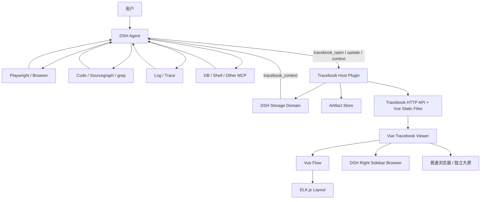
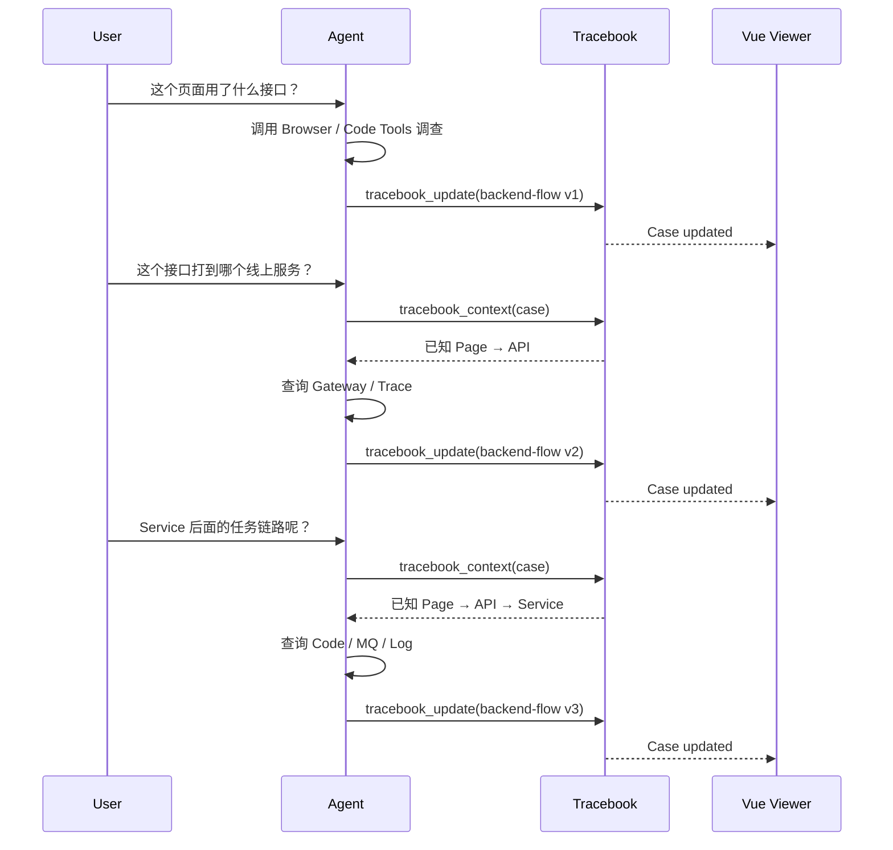

# Tracebook：DeepSeek Harness 工程调查结果组织插件设计

> 状态：方案设计稿 / MVP 开发基线  
> 更新时间：2026-09-22  
> 目标宿主：DeepSeek Harness（DSH）Web Profile  
> 前端：Vue 3 + Vue Flow + ELK.js  
> 核心定位：**Agent 负责探索，Tracebook 负责把 Agent 已经理解出的调查结果规范化、持久化、展示，并在后续对话中重新提供给 Agent。**

---

## 0. 一句话结论

Tracebook 不是 Exploration Engine，也不是新的 Agent Runtime。

它是运行在 DeepSeek Harness 上的一层：

> **AI 调查结果协议（CaseDocument） + 持久化（DSH Storage） + Artifact 管理 + 交互式 Viewer。**

Agent 继续使用原有的 Playwright、代码搜索、日志、Trace、数据库等工具进行调查；当 Agent 认为某些结果值得沉淀时，通过 Tracebook Tool 将结果写成规范化 Block。Tracebook 页面读取这些 Block，并用文本、表格、流程图、时间线、截图、证据卡片等方式展示。

最重要的产品闭环是：

```text
用户提问
  ↓
Agent 自主调查
  ↓
Agent 得到新的理解
  ↓
tracebook_update
  ↓
CaseDocument 增量更新
  ↓
Vue 页面实时/刷新展示
  ↓
用户继续追问
  ↓
Agent 读取已有 Tracebook Context 后继续调查
```

因此 Tracebook 最终沉淀的不是“Agent 执行日志”，而是：

> **随着用户持续追问而不断生长的一份工程调查文档。**

---

# 1. 背景与需求

现代业务功能经常跨越：

```text
页面
→ HTTP API
→ Gateway
→ Service
→ RPC / MQ
→ Worker
→ Database / Cache / Storage
→ Callback / SSE
→ 页面
```

Agent 已经可以通过各种工具独立完成调查，例如：

- 浏览器 / Playwright
- grep / ripgrep
- Sourcegraph
- GitHub / 本地代码库
- Log 查询
- Trace 查询
- Metrics
- 数据库查询
- Shell / SSH
- 各类内部 MCP / CLI

真正缺少的不是“再造一个探索工具”，而是：

1. Agent 每轮调查得到的信息容易散落在当前 Session。
2. 用户持续追问时，前几轮已经确认的业务链路缺少结构化沉淀。
3. 一次调查可能跨多个 Session，不能只依赖 Session 上下文。
4. 原始日志、截图、HTTP、Trace 与 Agent 最终理解之间缺少稳定组织方式。
5. 用户缺少一个比 Chat 更适合查看流程图、表格、截图和证据的页面。
6. 下一个 Agent / 新 Session 需要低成本读取已经调查出的工程 Context，而不是重新调查。

Tracebook 就是解决这几个问题。

---

# 2. 产品定位

## 2.1 Tracebook 负责什么

Tracebook 负责：

```text
AI Result
   ↓
Normalize
   ↓
Persist
   ↓
Render
   ↓
Reuse
```

具体包括：

- 保存一次调查主题（Case）。
- 接收 Agent 主动提交的结构化调查结果。
- 保存文本、事实、流程、表格、时间线、证据、截图等内容块。
- 保存 Screenshot / Log / HTTP / Trace 等大体积 Artifact。
- 允许同一个 Case 持续增量更新。
- 给 Vue 页面提供稳定的数据协议。
- 给后续 Agent 提供压缩后的 Case Context。
- 记录 Case 与 DSH Session 之间的关联，但不依赖某个 Session 生存。

## 2.2 Tracebook 不负责什么

以下能力明确不属于 Tracebook Core：

- Planner / Reasoner / Agent Loop
- 决定下一步应该调查什么
- 浏览器自动化
- 代码搜索
- 日志查询
- Trace 查询
- 数据库查询
- 自动 Root Cause Analysis
- 自动完整企业知识图谱
- 自动判断所有 Tool Result 是否值得保存
- 第一阶段自动 Entity Resolution / Entity Dedup

这些都由 DSH Agent 和现有 Tool / MCP 完成。

判断一个功能应不应该进入 Tracebook，可以使用一句话：

> **它是在“探索系统”，还是在“组织探索得到的信息”？**

探索系统 → 不属于 Tracebook。  
组织调查结果 → 属于 Tracebook。

---

# 3. 核心使用场景

## 3.1 产品现状探索

用户：

> 看一下“生成 PPT”目前是怎么工作的。

Agent 自己调查浏览器、接口、代码等，最后将结果写入 Tracebook：

```text
PPT 页面
  ↓ POST /slides/generate
slide-service
  ↓
slide.generate
  ↓
slide-worker
```

页面同时可以展示接口表、关键截图和证据。

## 3.2 持续追问、持续补充

第一轮用户问：

> 这个页面用了什么接口？

Case 可能只有：

```text
PPT Page
   ↓
POST /slides/generate
```

第二轮：

> 这个接口打到了哪个线上服务？

Agent 继续调查并更新同一个 Case：

```text
PPT Page
   ↓
POST /slides/generate
   ↓
slide-service
```

第三轮：

> slide-service 后面的任务怎么执行？

继续补充：

```text
PPT Page
   ↓
POST /slides/generate
   ↓
slide-service
   ↓
slide.generate
   ↓
slide-worker
```

关键设计：

> **Case 是长期对象，Block 是可增量 upsert 的。不是每一轮创建一份新报告。**

## 3.3 故障调查

Case 可以是：

```text
type = incident
```

Block 可以包含：

- 问题现象
- 已确认事实
- 请求链路 Flow
- Timeline
- 关键 Logs / Trace Evidence
- 当前结论

Tracebook 不负责推理根因，只负责保存 Agent 推理后的规范化结果。

## 3.4 AI 巡检

Case 可以是：

```text
type = inspection
```

Agent 定期执行巡检后，更新 Table / Facts / Timeline 等 Block。

第一版不需要为“巡检”单独设计数据库模型，只需要让 Block 协议足够通用。

---

# 4. 核心设计原则

## 4.1 AI 决定内容，Tracebook 决定协议

不要要求 Tracebook 理解：

```text
这是 API
这是 Service
这是 Function
这个节点和那个节点应该怎么关联
```

这些都交给 Agent。

Tracebook 只要求 Agent 按规范格式输出：

```text
CaseDocument
  + Blocks
  + Artifacts
```

## 4.2 Structured Document，而不是 Knowledge Graph

第一版不建立 Entity / Relation 数据库。

Graph 只是一个 `flow` Block，由 AI 自己决定 nodes / edges。

因此核心事实是：

```text
AI 的调查理解
        ↓
   Structured Blocks
        ↓
     UI Renderer
```

而不是：

```text
Raw Tool Result
        ↓
自动抽取 Entity
        ↓
自动 Knowledge Graph
```

## 4.3 Agent 主动写入

第一版不要求自动捕获全部 Tool Result。

由 Agent 自己判断什么时候调用 Tracebook；甚至初期可以依赖用户明确提示：

> 把这次结果整理到 Tracebook。

以后再考虑自动写入策略。

## 4.4 Case 生命周期独立于 Session

Session 是交互上下文。

Case 是调查资产。

```text
Session A ─┐
           ├── Case: PPT Generation
Session B ─┤
           │
Session C ─┘
```

用户换 Session 后仍然应该可以读取并继续该 Case。

## 4.5 大文件与结构化数据分离

结构化内容：

```text
Case / Block / Artifact Metadata
```

进入 DSH Storage。

大体积原始资料：

```text
Screenshot
完整日志
Trace JSON
HTTP Body
HTML
大文件
```

进入 Artifact Store，结构化数据仅保存引用。

---

# 5. 总体架构



关键点：

- Agent 仍然是探索主体。
- Tracebook Host 是数据与协议 owner。
- DSH Session 不是 Tracebook 的主存储。
- Vue Viewer 是独立 SPA，不嵌入 DSH React Component Tree。
- DSH 只负责通过 Sidebar Browser 打开 `/tracebook/...`。

---

# 6. Tracebook 核心数据协议

## 6.1 CaseDocument

CaseDocument 是 Tracebook、Agent、Storage、Vue 四方共同遵守的核心协议。

推荐概念结构：

```ts
interface CaseDocument {
  id: string
  title: string

  type?: 'exploration' | 'incident' | 'inspection' | 'architecture' | string
  status?: 'active' | 'completed' | 'archived'

  summary?: string

  environment?: string

  blocks: Block[]

  artifacts?: Artifact[]

  sourceSessions?: string[]

  revision: number
  createdAt: string
  updatedAt: string
}
```

注意：

- `type` 保持可扩展，不做封闭枚举。
- `environment` 第一版只是 Metadata，不做复杂环境模型。
- `revision` 为后续更新、缓存、并发控制预留。
- `sourceSessions` 只是关联，不代表 Case 属于这些 Session。

---

# 7. Block 是最重要的抽象

第一版推荐支持 7 种 Block：

```text
markdown
facts
flow
table
timeline
evidence
gallery
```

统一基础字段：

```ts
interface BlockBase {
  id: string
  type: string
  title?: string
  description?: string

  artifactRefs?: string[]
  sourceSessionId?: string

  updatedAt?: string
}
```

`block.id` 是增量更新的关键。

Agent 下一轮调查时，可以通过同一个 `block.id` 更新已有 Flow / Table，而不是重复创建。

---

## 7.1 Markdown Block

用于自由说明、结论、上下文。

```json
{
  "id": "overview-detail",
  "type": "markdown",
  "title": "功能说明",
  "content": "用户点击生成后，前端首先创建异步任务……"
}
```

适合：

- 功能说明
- 调查结论
- 现状描述
- 限制说明
- 当前未知项

---

## 7.2 Facts Block

适合少量关键事实。

```json
{
  "id": "key-facts",
  "type": "facts",
  "title": "已确认信息",
  "items": [
    { "label": "生成接口", "value": "POST /api/slides/generate" },
    { "label": "线上服务", "value": "slide-service" },
    { "label": "执行模式", "value": "异步任务" }
  ]
}
```

适合 Overview 区域。

---

## 7.3 Flow Block

用于 Vue Flow。

Tracebook 不理解 Node 类型，不维护 Entity 表；Agent 自己决定 nodes / edges。

```json
{
  "id": "backend-flow",
  "type": "flow",
  "title": "后端调用链",
  "direction": "TB",
  "nodes": [
    {
      "id": "page",
      "label": "PPT Page",
      "kind": "page"
    },
    {
      "id": "generate-api",
      "label": "POST /slides/generate",
      "kind": "api"
    },
    {
      "id": "slide-service",
      "label": "slide-service",
      "kind": "service"
    }
  ],
  "edges": [
    {
      "id": "page-api",
      "source": "page",
      "target": "generate-api",
      "label": "CALLS"
    },
    {
      "id": "api-service",
      "source": "generate-api",
      "target": "slide-service",
      "label": "ROUTES TO"
    }
  ]
}
```

建议 Node / Edge 允许附带：

```ts
artifactRefs?: string[]
relatedBlockIds?: string[]
details?: string
metadata?: Record<string, unknown>
```

这样用户点击 Vue Flow 节点时，可以在 Inspector 中展示更多信息。

### Flow 的重要约束

Vue Flow 只负责：

```text
渲染 + 交互
```

ELK.js 负责：

```text
自动布局
```

AI 负责：

```text
哪些节点值得画
节点含义
边含义
多个 Flow 如何拆分
```

不要要求 AI 输出 x/y 坐标。

---

## 7.4 Table Block

很多调查信息天然适合表格，而不是 Graph。

例如接口清单：

```json
{
  "id": "api-list",
  "type": "table",
  "title": "相关接口",
  "columns": [
    { "key": "api", "label": "接口" },
    { "key": "method", "label": "Method" },
    { "key": "service", "label": "Service" },
    { "key": "description", "label": "作用" }
  ],
  "rows": [
    {
      "api": "/slides/generate",
      "method": "POST",
      "service": "slide-service",
      "description": "创建 PPT 生成任务"
    }
  ]
}
```

典型用途：

- 页面清单
- API 清单
- Service 清单
- DB 表清单
- 任务清单
- 巡检结果

---

## 7.5 Timeline Block

Timeline 更建议描述“业务发生过程”，而不是简单复刻 Agent Tool Call。

```json
{
  "id": "generate-timeline",
  "type": "timeline",
  "title": "PPT 生成过程",
  "items": [
    {
      "title": "创建任务",
      "description": "POST /slides/generate 返回 task_id"
    },
    {
      "title": "Worker 开始处理",
      "description": "slide-worker 消费 slide.generate"
    },
    {
      "title": "结果写入",
      "description": "生成文件保存并回写结果"
    }
  ]
}
```

Agent 可以根据调查目标自行决定是否生成 Timeline。

---

## 7.6 Evidence Block

Evidence 的目标不是建立复杂证据数据库，而是告诉用户：

> “AI 为什么得出这个结论？”

```json
{
  "id": "key-evidence",
  "type": "evidence",
  "title": "关键证据",
  "items": [
    {
      "id": "ev-http-generate",
      "kind": "http",
      "title": "页面生成请求",
      "summary": "点击生成后发送 POST /api/slides/generate",
      "artifactRef": "artifact-http-001"
    },
    {
      "id": "ev-trace-route",
      "kind": "trace",
      "title": "线上 Trace",
      "summary": "请求进入 slide-service",
      "artifactRef": "artifact-trace-001"
    }
  ]
}
```

`kind` 不需要强枚举，可以是：

```text
http
trace
log
code
db
screenshot
tool-result
file
other
```

---

## 7.7 Gallery Block

产品现状探索中 Screenshot 很重要。

```json
{
  "id": "page-gallery",
  "type": "gallery",
  "title": "页面流程",
  "items": [
    {
      "artifactRef": "shot-001",
      "caption": "PPT 创建页"
    },
    {
      "artifactRef": "shot-002",
      "caption": "任务生成中页面"
    }
  ]
}
```

---

# 8. Artifact 模型

Artifact 用于保存不适合直接进入 CaseDocument 的原始数据。

推荐：

```ts
interface Artifact {
  id: string
  caseId: string

  kind: string
  mimeType?: string

  name?: string
  path?: string
  size?: number

  summary?: string
  metadata?: Record<string, unknown>

  createdAt: string
}
```

典型 Artifact：

```text
Screenshot PNG
HTTP request/response JSON
Trace JSON
Log TXT
HTML
Code snapshot
CSV
其他调查文件
```

CaseDocument 中尽量只存：

```text
artifactRef
```

而不内嵌大体积原文。

---

# 9. Agent 与 Tracebook 的交互设计

第一版建议只暴露 3 个核心 Model-facing Tool。

## 9.1 `tracebook_open`

用途：

- 创建一个 Case。
- 恢复已有 Case。
- 将当前 Session 与 Case 建立关联。
- 设置当前 Session 的 active Case。

概念参数：

```json
{
  "caseId": "optional-existing-id",
  "title": "PPT 生成功能",
  "type": "exploration",
  "environment": "production"
}
```

返回：

```text
caseId
当前 summary
已有 block 摘要
revision
```

---

## 9.2 `tracebook_update`

这是最重要的 Tool。

用途：

> 将 Agent 本轮已经理解好的调查结果增量写入当前 Case。

推荐采用 upsert，而不是要求 Agent 每次重写完整 CaseDocument。

```json
{
  "caseId": "case-ppt",
  "summary": "PPT 生成采用异步任务，目前已确认页面、API、线上服务和 Worker 链路。",
  "upsertBlocks": [
    {
      "id": "backend-flow",
      "type": "flow",
      "title": "后端调用链",
      "nodes": [],
      "edges": []
    },
    {
      "id": "api-list",
      "type": "table",
      "title": "相关接口",
      "columns": [],
      "rows": []
    }
  ],
  "artifacts": []
}
```

重要原则：

```text
Agent 决定写什么
Tracebook 只验证 Schema + 保存
```

第一版不需要 Agent 每完成一个 Tool Call 就 update。

初期可以通过用户主动提示触发：

> 把调查结果更新到 Tracebook。

---

## 9.3 `tracebook_context`

用途：

> 给当前 Agent / 新 Agent 获取已有 Case 的压缩 Context。

例如用户第二天说：

> 继续看一下 PPT callback 的流程。

Agent 可以先读取：

```json
{
  "caseId": "case-ppt",
  "query": "callback"
}
```

返回结果应该是 AI-friendly Context，而不是完整数据库 Dump：

```text
Case: PPT 生成功能

Summary:
PPT 生成采用异步任务，目前已确认页面、API、slide-service 与 worker。

Relevant blocks:
- backend-flow: Page → POST /slides/generate → slide-service → worker
- key-facts: service=slide-service

Open / unclear:
- callback 后续链路尚未完整确认
```

第一版可以简单通过：

```text
summary + block title + block 内容截断
```

实现，不需要 Embedding / Vector DB。

---

# 10. 持续追问时的数据更新流程

Tracebook 最重要的能力之一就是支持 Case 持续成长。



这里不存在所谓“最终 Graph”。

Graph / Table / Timeline 都只是：

> **当前 Case 在当前认知下的最新表达。**

---

# 11. 存储方案

## 11.1 不建议把 Tracebook 主数据存进 DSH Session

DSH Session Persistence 的核心是持久化 append-only `SessionEvent` log。

它适合：

```text
User Message
Assistant Message
Tool Call
Tool Result
Session Replay
```

而 Tracebook Case：

- 生命周期可能长于一个 Session。
- 一个 Case 可能被多个 Session 使用。
- Block 会被后续 Agent upsert。
- 页面需要独立读取 Case。

因此：

```text
Session = 交互记录
Case = 工程调查资产
```

两者只建立 Link。

## 11.2 使用 DSH Storage Subsystem

DSH 已经提供专门用于“非 Session Event Log 数据”的 Storage subsystem：

```text
ctx.storage
ctx.storageDomain
```

官方当前提供 JSON 和 SQLite backend。

Tracebook Core 不应该直接依赖 SQLite API，而应该依赖 DSH Storage Domain。

推荐：

```text
Tracebook
   ↓
ctx.storageDomain
   ↓
default provider: sqlite
```

SQLite 是默认推荐，而不是 Tracebook 的硬依赖。

未来如果切换 Storage Provider，核心业务协议不变。

## 11.3 MVP Storage 逻辑结构

推荐至少保存：

```text
cases
blocks
artifacts
session_links
```

概念 key：

```text
cases/<caseId>
blocks/<caseId>/<blockId>
artifacts/<artifactId>
session-links/<sessionId>
```

不要求第一版复杂 SQL JOIN。

## 11.4 Artifact Store

大文件走文件系统目录：

```text
<tracebook-data>/artifacts/
  case-001/
    screenshot-001.png
    trace-001.json
    log-001.txt
```

路径通过插件配置或 DSH Home 相关能力解析，不让 Vue 直接访问本地文件系统。

---

# 12. Vue 前端方案

## 12.1 不推荐 React → Vue Bridge 作为主方案

DSH Web 原生 UI Slot 最终由 React Renderer 组装。

理论上可以：

```text
DSH React Slot
  ↓
React Bridge
  ↓
Vue createApp()
```

但 Tracebook 页面未来包含：

- 多个内容块
- Vue Flow
- Timeline
- Screenshot Gallery
- Evidence Inspector
- 搜索 / 筛选
- 大图与复杂流程图

它已经是一个完整应用，而不是一个小 Widget。

因此长期更合理的是：

> **Tracebook Vue 是独立 SPA，由 DSH Host Web Server 提供。**

## 12.2 页面由 DSH Web Server 提供

DSH Host 提供 `ctx.webServer`，允许功能插件注册自己的 route。

Tracebook 注册：

```text
/tracebook/*
```

例如：

```text
http://127.0.0.1:3080/tracebook/
http://127.0.0.1:3080/tracebook/cases/case-ppt
```

同时提供同源 API：

```text
/tracebook/api/*
```

这样无需：

- 单独 Express Server
- 第二个端口
- 生产环境 Vite Server

## 12.3 在 DSH 内打开

DSH Web 当前自带 Right Sidebar Browser，可以浏览 sandboxed HTTP(S) 页面，包括 loopback targets。

因此最简单的集成方式是：

```text
DSH Chat
   │
   ├── Tracebook 按钮 / 链接
   │
   ▼
Right Sidebar Browser
   │
   ▼
/tracebook/cases/:id
```

优势：

- 用户可以边聊天边看 Tracebook。
- Vue 不需要嵌入 React。
- Vue 项目几乎与 DSH UI 框架解耦。
- 同一个 URL 也可以直接在普通浏览器打开全屏查看。

## 12.4 可选 Thin Client Plugin

可以提供一个很薄的 DSH Browser-side Client Plugin，只负责：

- 在合适位置增加“打开 Tracebook”入口。
- 调用 Right Sidebar Browser 打开当前 Case URL。
- 后续如果需要，实现 Vue → 主 Chat 的 follow-up bridge。

它不承载 Vue 业务页面。

---

# 13. Vue 页面信息架构

不要固定成“Graph 系统”。

更合理的定位是：

> **Interactive Document with Blocks**

一个 Case 页面按 Agent 输出的 Block 顺序渲染。

推荐：

```text
┌────────────────────────────────────────────────────────────┐
│ PPT 生成功能                           production · active │
│                                                            │
│ Summary                                                    │
│ PPT 生成采用异步任务，目前已确认……                         │
├────────────────────────────────────────────────────────────┤
│ 已确认信息 [Facts Block]                                   │
├────────────────────────────────────────────────────────────┤
│ 后端调用链 [Flow Block / Vue Flow]                         │
├────────────────────────────────────────────────────────────┤
│ 相关接口 [Table Block]                                     │
├────────────────────────────────────────────────────────────┤
│ 执行过程 [Timeline Block]                                  │
├────────────────────────────────────────────────────────────┤
│ 页面截图 [Gallery Block]                                   │
├────────────────────────────────────────────────────────────┤
│ 关键证据 [Evidence Block]                                  │
└────────────────────────────────────────────────────────────┘
```

### 推荐布局

全屏页面：

```text
左侧：Block Outline / Case 导航
中间：Document Blocks
右侧：Inspector / Artifact Preview
```

DSH Sidebar 窄屏模式：

```text
Outline 折叠
Document 占满
Inspector 使用 Drawer
```

---

# 14. Vue Block Renderer

推荐组件结构：

```text
BlockRenderer
├── MarkdownBlock.vue
├── FactsBlock.vue
├── FlowBlock.vue
├── TableBlock.vue
├── TimelineBlock.vue
├── EvidenceBlock.vue
└── GalleryBlock.vue
```

核心渲染逻辑：

```vue
<BlockRenderer
  v-for="block in blocks"
  :key="block.id"
  :block="block"
/>
```

这样以后增加新 Block：

```text
metric
scorecard
diff
code
```

只增加 Renderer，不需要推翻 CaseDocument。

---

# 15. Vue Flow 设计

Vue Flow 非常适合 Flow Block。

建议职责：

```text
AI
  → 生成 nodes / edges / label / kind

ELK.js
  → 计算 x / y / edge routing 等布局

Vue Flow
  → 渲染、缩放、拖动、选择、Minimap、交互
```

不要让 AI 维护位置坐标。

## 15.1 为什么需要 ELK.js

Vue Flow 是渲染与交互库，不是完整自动布局引擎。

ELK.js 的 layered layout 很适合：

```text
Page
 ↓
Gateway
 ↓
Service
 ↓
MQ
 ↓
Worker
```

这类天然有方向的工程链路图。

## 15.2 Flow Inspector

点击 Node 后显示：

```text
Node: slide-service

Details
...

Related Blocks
- key-facts
- api-list

Artifacts
- trace-001
- log-003
```

因此 Flow Node 可以带：

```text
relatedBlockIds
artifactRefs
metadata
```

Graph 负责导航，详情仍来自 CaseDocument / Artifact。

## 15.3 不要做“大一统 Graph”

Agent 可以生成多个 Flow Block：

```text
用户操作流程
Backend 调用链
异步任务流程
数据流
```

例如：

```text
Flow Block A: user-flow
Flow Block B: backend-flow
Flow Block C: data-flow
```

这比把 100 个 Node 堆进一个 Graph 更适合长期使用。

---

# 16. 用户与页面的交互

第一阶段重点是：

- 点击 Flow Node / Edge 看详情。
- 展开 Evidence。
- 预览 Screenshot / HTTP / Log / Trace Artifact。
- Table 筛选。
- Gallery 查看。
- Case List / Case Search。

用户继续调查仍然以主 DSH Chat 为主：

```text
用户看到 Tracebook
   ↓
回到 Chat 继续提问
   ↓
Agent 调查
   ↓
Agent tracebook_update
   ↓
页面更新
```

## 16.1 后续可做：Ask About This

用户选择某个 Flow Node：

```text
slide-service
```

点击：

```text
Ask about this
```

形成 Context Envelope：

```json
{
  "caseId": "case-ppt",
  "blockId": "backend-flow",
  "selection": {
    "type": "node",
    "id": "slide-service"
  },
  "question": "这个服务后面还调用了谁？"
}
```

然后由 Thin Client Plugin 将其发送/填充到当前 DSH Conversation。

这属于 V2，不作为 MVP 阻塞项。

---

# 17. Tracebook HTTP API

因为 Vue SPA 独立运行在 DSH Web Server 下，推荐提供简单的同源 HTTP API。

MVP 可以包括：

```text
GET  /tracebook/api/cases
GET  /tracebook/api/cases/:id
GET  /tracebook/api/cases/:id/blocks
GET  /tracebook/api/artifacts/:id
```

如果后续允许页面人工编辑：

```text
PATCH /tracebook/api/cases/:id
PATCH /tracebook/api/cases/:id/blocks/:blockId
```

第一版推荐：

> **Agent Tool 是主要写入口，Vue API 主要负责读。**

这样可以减少写路径与权限模型复杂度。

---

# 18. DSH Bundle 设计

推荐最终发布：

```text
@your-scope/dsh-tracebook
```

用户安装：

```bash
dsh plugin --profile web add @your-scope/dsh-tracebook
```

开发期也可以：

```bash
dsh plugin --profile web add ./dsh-tracebook
```

Tracebook 是一个 Bundle，但 Bundle 内可以挂多个 Cordis plugin entry。

---

# 19. 推荐代码结构

```text
dsh-tracebook/
│
├── package.json
├── cordis.patch.yml
│
├── src/
│   ├── host/
│   │   ├── index.ts
│   │   ├── service.ts
│   │   │
│   │   ├── model/
│   │   │   ├── case.ts
│   │   │   ├── block.ts
│   │   │   └── artifact.ts
│   │   │
│   │   ├── storage/
│   │   │   ├── domain.ts
│   │   │   └── artifact-store.ts
│   │   │
│   │   ├── tools/
│   │   │   ├── open.ts
│   │   │   ├── update.ts
│   │   │   └── context.ts
│   │   │
│   │   └── http/
│   │       ├── api.ts
│   │       └── static.ts
│   │
│   └── client/
│       └── index.ts          # optional thin DSH client plugin
│
├── web/
│   ├── package.json
│   ├── vite.config.ts
│   └── src/
│       ├── App.vue
│       ├── api/
│       ├── stores/
│       ├── pages/
│       │   ├── CaseList.vue
│       │   └── CaseDetail.vue
│       └── components/
│           └── blocks/
│               ├── BlockRenderer.vue
│               ├── MarkdownBlock.vue
│               ├── FactsBlock.vue
│               ├── FlowBlock.vue
│               ├── TableBlock.vue
│               ├── TimelineBlock.vue
│               ├── EvidenceBlock.vue
│               └── GalleryBlock.vue
│
└── dist/ or lib/
```

MVP 不建议拆成很多 npm package；先保证内部模块边界清楚。

---

# 20. DeepSeek Harness 插件原理简述

## 20.1 Everything is Plugin

DSH 底层使用 Cordis。

Agent loop、Tool Registry、Session、模型适配器等本身都可以作为插件存在。

插件通过共享 Context 获取能力：

```text
ctx.tools
ctx.sessions
ctx.storage
ctx.storageDomain
ctx.webServer
...
```

插件之间应通过 Service key 依赖，而不是直接绑定具体实现。

## 20.2 `inject` 声明依赖

Cordis 插件不应该依赖 YAML 顺序保证启动时序。

插件声明：

```ts
export const inject = ['tools', 'storageDomain', 'webServer']
```

Cordis 会等依赖 Service ready 后再启动插件。

## 20.3 Bundle 与 Profile

DSH 运行时是一棵插件树。

- **Bundle**：一个可以安装的配置层，声明它向插件树插入哪些 row。
- **Profile**：一套最终运行组合，例如 web profile。

Bundle package.json：

```json
{
  "name": "@your-scope/dsh-tracebook",
  "version": "0.1.0",
  "type": "module",
  "dsh": {
    "bundle": {
      "patch": "./cordis.patch.yml"
    }
  }
}
```

`cordis.patch.yml` 概念：

```yaml
- insert:
    - id: tracebook
      name: '@your-scope/dsh-tracebook'
```

具体字段以当前 DSH 官方 publish 文档为准。

验证实际组合：

```bash
dsh --profile web --dump-config
```

## 20.4 Host Plugin

Tracebook 的权威状态必须位于 Host：

```text
Tracebook Service
Storage
Tool
HTTP API
Artifact
```

Vue Client 只读取投影数据，不应该直接访问 Storage / 文件系统。

## 20.5 注册 Agent Tool

DSH Tool Registry 为：

```text
ctx.tools
```

Tool 插件通过 `ctx.tools.register(...)` 注册给模型。

Tracebook 注册：

```text
tracebook_open
tracebook_update
tracebook_context
```

模型会看到 Tool 的 name / description / parameters。

Tool Schema 应尽量直接表达业务协议，不把内部 Storage 细节暴露给模型。

## 20.6 Storage

DSH Storage subsystem 专门负责“不是 Session Event Log 的持久数据”。

Tracebook 应依赖：

```text
ctx.storageDomain
```

而不是：

```text
直接 import sqlite
```

默认 profile 可以选择 SQLite Provider。

## 20.7 Web Server

DSH Web Host 提供：

```text
ctx.webServer
```

功能插件可以注册自己的 exact / prefix route。

Tracebook 使用它提供：

```text
/tracebook/*
/tracebook/api/*
```

而不是启动一个新的长期 Server。

## 20.8 Browser-side Client Plugin

DSH Web Client 本身也是浏览器侧 Cordis 应用。

声明 `dsh.client` 且导出 `./client` 的 package 可以被 Client Modules 系统发现并加载。

Tracebook 第一版只需要一个很薄的 client 插件：

```text
注册入口 / 按钮
→ 打开 Right Sidebar Browser
→ /tracebook/cases/:id
```

Vue SPA 本身不需要变成 React Slot Component。

## 20.9 Remote API 是否需要

DSH 有正式的 Host ↔ Client `ctx.remote` / `@Remote` API Gateway。

Tracebook 当前 Vue SPA 是独立同源页面，所以 MVP 可以优先走：

```text
ctx.webServer + /tracebook/api
```

后续 Thin Client Plugin 如果需要：

- 获取 active session
- 发送 follow-up 到 DSH Conversation
- 与 DSH Client model 做更深交互

再引入 Remote API。

不要为了“看起来 DSH 原生”而在第一版同时维护 HTTP API + Remote 两套写路径。

---

# 21. DSH 开发建议

## 21.1 与 DSH 的耦合集中在少数 Adapter

DSH 当前仍属于快速演进阶段。

建议让领域层完全不知道 DSH：

```text
CaseDocument
Block
Artifact
Repository Interface
```

只有这些位置依赖 DSH：

```text
DSH Tool Adapter
DSH Storage Adapter
DSH WebServer Adapter
DSH Client Entry Adapter
```

这样后续 DSH API 有 Breaking Change 时，不需要重写 Tracebook Core。

## 21.2 不 fork DSH Web

不要：

```text
fork apps/web
修改 DSH React 页面
```

优先：

```text
Bundle + Host Plugin + Web Route + Thin Client Module
```

## 21.3 开发期先本地 Bundle

推荐流程：

```bash
dsh plugin --profile web add ./dsh-tracebook

dsh --profile web --dump-config

dsh --profile web
```

开发时先确认：

1. Bundle 是否进入 profile。
2. Host plugin 是否 mounted。
3. `ctx.tools` 是否看到三个 Tracebook Tool。
4. `/tracebook/` 是否正常返回 Vue 页面。
5. `/tracebook/api/...` 是否可访问。
6. Sidebar Browser 是否能打开同一个页面。

## 21.4 Git 安装注意构建产物

如果未来允许：

```bash
dsh plugin --profile web add github:xxx/dsh-tracebook
```

需要注意 DSH 官方文档指出：Git 安装拿到的是源码，TypeScript 项目必须通过 `prepare` 等方式产生运行时构建产物，且 pnpm 10+ 对依赖安装期构建有显式授权要求。

正式分发更推荐：

- npm 发布预构建产物。
- 或 `pnpm pack` 生成 tarball。

---

# 22. MVP 范围

第一版只做：

## Host

- Case 创建 / 打开。
- CaseDocument / Block Schema。
- `tracebook_open`。
- `tracebook_update`。
- `tracebook_context`。
- DSH Storage Domain。
- Artifact 文件保存。
- `/tracebook/api/*`。
- `/tracebook/*` Vue Static。

## Vue

- Case List。
- Case Detail。
- Summary。
- 7 种 Block Renderer。
- Vue Flow。
- ELK.js 自动布局。
- Flow Node Inspector。
- Artifact Preview 基础能力。

## DSH 集成

- Bundle 安装。
- 可选 Thin Client Entry。
- 从 DSH 打开 `/tracebook/cases/:id` 到 Sidebar Browser。

---

# 23. MVP 明确不做

先不做：

- 自动监听所有 Tool Call。
- 自动识别“这个 Tool Result 值得保存”。
- 自动 Entity Resolution。
- Knowledge Graph。
- Global Engineering Graph。
- Vector DB。
- Embedding / RAG。
- 自动跨 Case 合并。
- 多 Agent 冲突解决。
- CRDT。
- 复杂权限系统。
- Artifact 自动 TTL。
- 自动敏感信息脱敏流水线。
- 页面直接控制 Agent 的完整交互闭环。
- 独立 Tracebook Server。

这些全部放到真正出现需求后再讨论。

---

# 24. MVP 验收场景

给 DSH Agent 一个任务：

> 调查“生成 PPT”功能目前是怎么工作的，并把结果整理到 Tracebook。

Agent 自己调用现有能力完成：

```text
打开页面
↓
发现 API
↓
查代码 / Trace
↓
发现线上 Service
↓
继续调查 Worker
```

然后写入 Tracebook。

最终必须能够看到：

### Case 首页

```text
PPT 生成功能
Summary: PPT 生成采用异步任务……
```

### Facts

```text
生成接口: POST /slides/generate
线上服务: slide-service
模式: async
```

### Flow

```text
PPT Page
   ↓
POST /slides/generate
   ↓
slide-service
   ↓
slide.generate
   ↓
slide-worker
```

### Table

接口清单。

### Evidence

- HTTP Request
- Trace
- Code Reference

### Gallery

实际页面截图。

之后用户继续问：

> slide-worker 后面把结果写到哪里？

Agent：

1. 调用 `tracebook_context` 获取已有 Case。
2. 继续调查。
3. 调用 `tracebook_update` 更新原有 `backend-flow`。
4. Vue 页面看到原图继续生长，而不是创建第二份报告。

如果这一闭环成立，Tracebook MVP 即成功。

---

# 25. 后续演进方向（非 MVP）

按真实需求再逐步增加：

## V1.x

- Case 搜索。
- Block 搜索。
- Artifact 类型增强。
- Flow 多 Layout。
- Flow diff。
- 版本历史。

## V2

- `Ask about this`：从 Node / Evidence 直接回到 DSH Conversation。
- Client Plugin 与 active Session 的深度联动。
- Agent 自动判断是否更新 Tracebook。
- 部分 Tool Result 自动转 Artifact。

## V3

如果数据规模和需求真的出现，再评估：

- 全文搜索 / FTS。
- Embedding。
- 跨 Case Context Retrieval。
- 多 Case System Map。
- Global Engineering Knowledge。

原则：

> 不要提前把 Tracebook 做成知识图谱平台。

---

# 26. 推荐的第一阶段开发拆分

如果使用多个 Agent / Worktree 并行开发，可以拆为：

## Task A：Core Protocol

负责：

- CaseDocument types
- Block types
- Artifact types
- Schema validation
- update/upsert 语义

完全不依赖 Vue。

## Task B：DSH Host Integration

负责：

- Cordis plugin entry
- Storage Domain
- `ctx.tracebook` service（可选）
- Bundle / patch
- DSH profile 安装验证

## Task C：Agent Tools

负责：

- `tracebook_open`
- `tracebook_update`
- `tracebook_context`

## Task D：HTTP + Artifact

负责：

- `/tracebook/api`
- Vue static route
- artifact metadata / file serving

## Task E：Vue Base

负责：

- Case List
- Case Detail
- BlockRenderer
- Markdown / Facts / Table / Timeline / Evidence / Gallery

## Task F：Vue Flow

负责：

- FlowBlock
- Vue Flow
- ELK.js
- Node Inspector
- responsive layout

## Task G：DSH Client Entry

最后接入：

- Tracebook 入口
- 打开 Sidebar Browser
- 当前 Case URL

A 的 Schema 是其它任务共同依赖的契约，应优先完成。

---

# 27. 官方文档 / Git 地址附录

以下链接基于 2026-09-22 当前 DeepSeek Harness `master` 文档结构；DSH 仍在快速演进，开发时应以仓库最新版本为准。

## 27.1 DeepSeek Harness

### Repository

- https://github.com/deepseek-ai/deepseek-harness

### README 中文

- https://github.com/deepseek-ai/deepseek-harness/blob/master/README.zh.md

### Architecture

DSH 一切皆插件、Profile / Bundle 等整体架构：

- https://github.com/deepseek-ai/deepseek-harness/blob/master/docs/architecture.md

### Cordis Primer 中文

理解 `ctx`、Service、`inject`、Event、Effect：

- https://github.com/deepseek-ai/deepseek-harness/blob/master/docs/cordis-primer.zh.md

### Cordis Tutorial 中文

- https://github.com/deepseek-ai/deepseek-harness/blob/master/docs/cordis-tutorial/index.zh.md

### First Plugin

- https://github.com/deepseek-ai/deepseek-harness/blob/master/docs/cordis-tutorial/01-first-plugin.md

---

## 27.2 Bundle / Plugin 发布

### Package and install a plugin

Bundle manifest、`cordis.patch.yml`、`dsh plugin add`、Profile 层级：

- https://github.com/deepseek-ai/deepseek-harness/blob/master/docs/user/develop/basic/publish.md

### 实际 composition 示例

- https://github.com/deepseek-ai/deepseek-harness/blob/master/apps/cli/composition.md

---

## 27.3 Agent Tool

### Adding a Tool

- https://github.com/deepseek-ai/deepseek-harness/blob/master/docs/cookbook/adding-a-tool.md

### Tool Registry package

- https://github.com/deepseek-ai/deepseek-harness/blob/master/packages/core/tools/README.md

---

## 27.4 Storage / Session

### Storage Subsystem

非 Session Event Log 的数据持久化；`ctx.storage` / `ctx.storageDomain`，JSON / SQLite providers：

- https://github.com/deepseek-ai/deepseek-harness/blob/master/docs/subsystems/storage.md

### Session Persistence

理解为什么 Tracebook 不应该直接变成 Session Event Log：

- https://github.com/deepseek-ai/deepseek-harness/blob/master/docs/subsystems/persistence.md

---

## 27.5 Web Host / Vue 页面

### HTTP Server

`ctx.webServer`、named route、prefix route：

- https://github.com/deepseek-ai/deepseek-harness/blob/master/docs/subsystems/web-server.md

### Web Client Architecture 中文

理解 Host 状态 → Remote → Client Model → UI 的官方分层：

- https://github.com/deepseek-ai/deepseek-harness/blob/master/docs/subsystems/web-client.zh.md

### Client package map 中文

包含 Right Sidebar Browser 等 Web UI package：

- https://github.com/deepseek-ai/deepseek-harness/blob/master/packages/client/README.zh.md

### Right Sidebar

- https://github.com/deepseek-ai/deepseek-harness/blob/master/docs/subsystems/sidebar-right.md

---

## 27.6 Browser-side Plugin

### Client Modules

`dsh.client`、`./client`、`window.__DSH_BOOT__`、browser-side Cordis module：

- https://github.com/deepseek-ai/deepseek-harness/blob/master/docs/subsystems/client-modules.md

### Client Modules 中文

- https://github.com/deepseek-ai/deepseek-harness/blob/master/docs/subsystems/client-modules.zh.md

### Client Modules package README

- https://github.com/deepseek-ai/deepseek-harness/blob/master/packages/client/modules/README.md

---

## 27.7 Remote API（V2 可能使用）

### API Gateway

- https://github.com/deepseek-ai/deepseek-harness/blob/master/docs/api-gateway.md

### Adding a Remote API

- https://github.com/deepseek-ai/deepseek-harness/blob/master/docs/cookbook/adding-a-remote-api.md

---

## 27.8 Skill（如果以后做 Tracebook 使用规范）

Skill 应用于“告诉 Agent 什么时候、怎样整理 Tracebook”，而不是实现 Tracebook 本身。

- https://github.com/deepseek-ai/deepseek-harness/blob/master/docs/subsystems/skills.md
- https://github.com/deepseek-ai/deepseek-harness/blob/master/packages/skill/README.md

---

## 27.9 Vue Flow / Layout

### Vue Flow

- https://vueflow.dev/
- https://github.com/bcakmakoglu/vue-flow

### ELK.js

- https://github.com/kieler/elkjs

ELK.js 负责布局，Vue Flow 负责渲染与交互，两者职责不要混在一起。

---

# 28. 最终架构原则总结

```text
Agent explores.
Tracebook organizes.
```

进一步展开：

```text
Session ≠ Case
Tool Result ≠ Tracebook Result
AI decides semantics
Tracebook defines schema
Block > Entity Graph
Artifact > Huge Inline Payload
DSH Storage > Hard-coded SQLite
Vue SPA > React-Vue Deep Embed
Vue Flow = Renderer
ELK.js = Layout
Case grows incrementally
```

Tracebook 的第一阶段不要试图成为“万能工程知识平台”。

只要把下面这个闭环做到足够好：

```text
用户追问
→ Agent 调查
→ Agent 规范化结果
→ Tracebook 持久化
→ Vue 高质量展示
→ 下一轮 Agent 重新读取
→ 继续补充
```

这个插件就已经具有明确且独立的价值。
