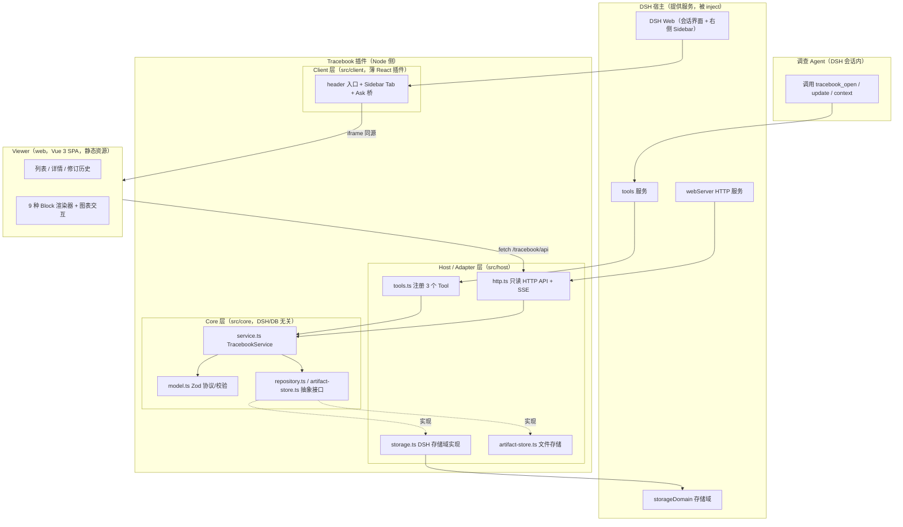
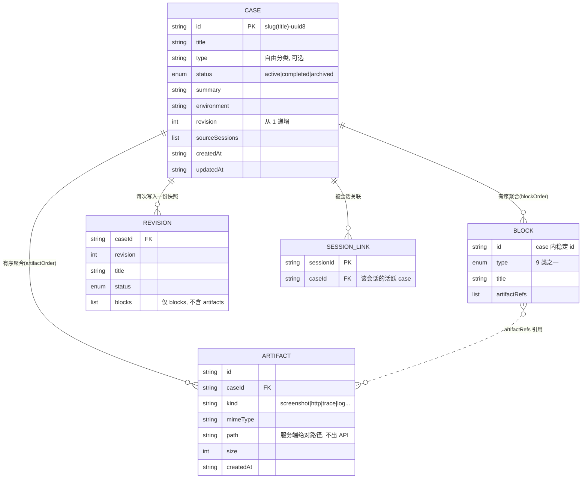
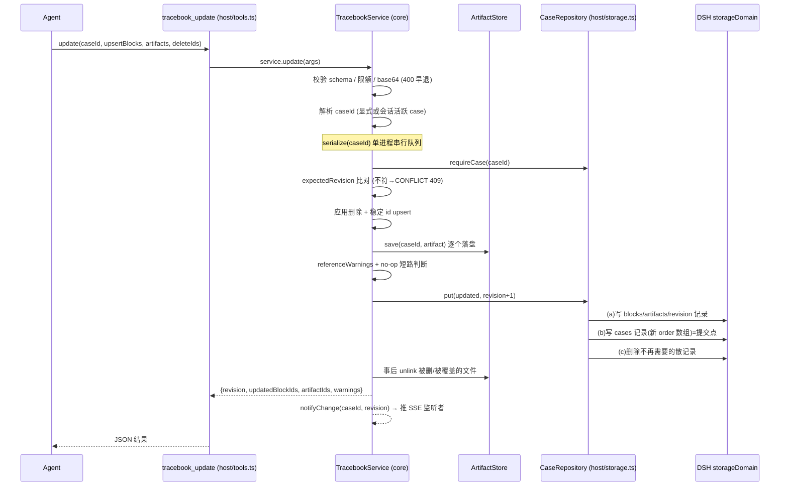
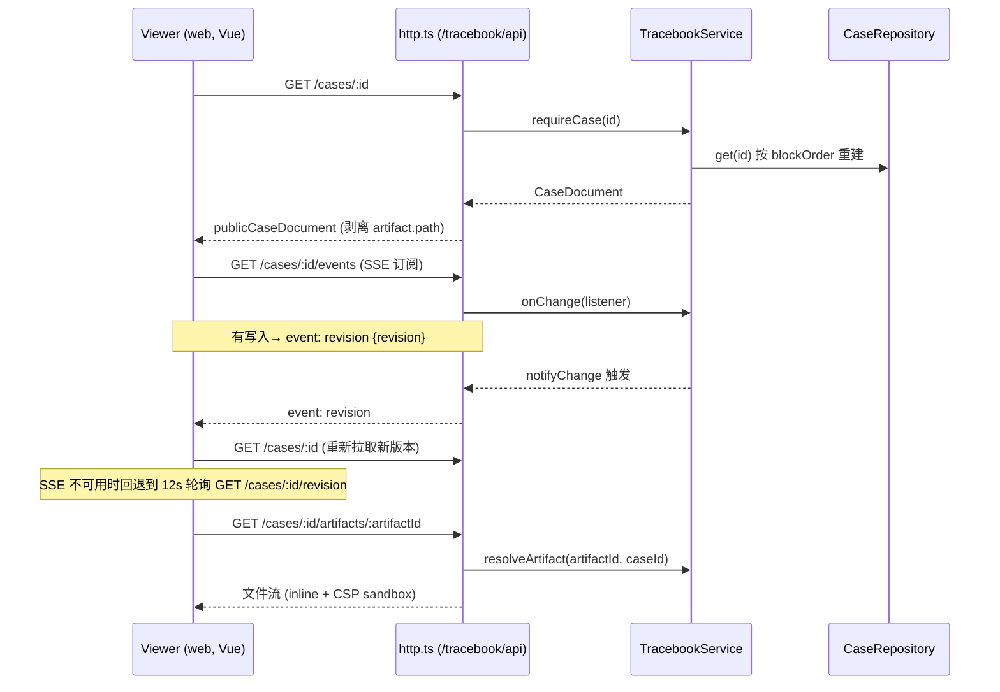
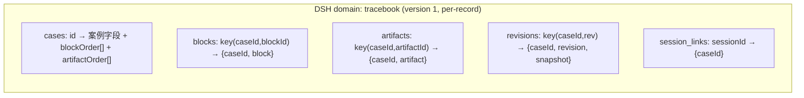

# Tracebook 原理说明

> 依据：仓库 `main` 分支当前代码（`@songxiyuan/dsh-tracebook`）｜整理日期：2026-09-27
> 方法：只读代码归纳；结论均标注 `文件:行` 便于回源。所有关系图用 Mermaid，md 原生可渲染。

本文讲清 Tracebook「是什么、怎么装配、Agent 怎么写数据、数据如何持久化与展示、各层边界在哪」。

## 目录

1. 一句话定位与产品边界
2. 框架结构图（分层架构）
3. 核心概念：Block（叙事）vs Artifact（证据）
4. 数据模型
5. Agent 写入协议（三个核心 Tool）
6. 交互时序图（写入链 / 读取与实时链）
7. 持久化与存储抽象
8. Artifact 存取链路
9. Viewer 渲染体系
10. DSH 集成方式
11. 关键设计约束与不变式

---

## 1. 一句话定位与产品边界

**Tracebook 是 DeepSeek Harness（DSH）上的「工程调查结果组织插件」。** 它不是 Agent Runtime、探索引擎，也不是自动根因分析系统——**Agent 决定调查什么，Tracebook 只负责定义、校验、存储与展示协议**（`AGENTS.md` §1）。

核心职责固定为五件事：

1. **规范化**调查结果（严格 schema 的 typed block）；
2. **持久化** Case（通过 Storage 抽象落到 DSH 存储域）；
3. **管理 Artifact**（原始证据文件 + 元数据）；
4. **展示**结果（同源 Vue Viewer）；
5. 向**后续 Agent 提供上下文**（`tracebook_context`）。

插件对外的能力面收敛成三样：**3 个 Agent Tool**（写入 / 读取上下文）、**一组只读 HTTP API**（供 Viewer 拉数据）、**一个静态 Vue SPA**（Viewer）。装配入口见 `src/index.ts:18`（`name = 'tracebook'`、`inject = ['tools','storageDomain','webServer']`）。

---

## 2. 框架结构图（分层架构）

Tracebook 分四层，依赖方向严格单向（外层依赖内层，Core 不依赖任何外部实现）：

各层职责与约束：

| 层 | 目录 | 职责 | 关键约束 |
| --- | --- | --- | --- |
| **Core** | `src/core` | 领域模型、校验、编排（open/update/context）、Repository / ArtifactStore 抽象 | 不得依赖 DSH 或具体数据库；只认接口（`AGENTS.md` §2） |
| **Host** | `src/host` | 把 Core 接到 DSH：Tool 注册、HTTP 路由、存储域实现、文件 Artifact 存储 | DSH API 只在此层出现 |
| **Client** | `src/client` | 薄 React 客户端插件：会话头入口、右侧 Sidebar Tab（iframe 承载 Viewer）、`Ask about this` 回灌桥 | 不 fork DSH Web；不持业务状态（`src/client/index.tsx:1-9`） |
| **Web** | `web` | Vue 3 Viewer SPA：读 HTTP API 渲染 Case | 只读同源 HTTP，不写第二条数据通路 |

**插件生命周期**（`src/index.ts:34-52`）：`apply()` 里用 `ctx.effect` 异步装配——打开 DSH 存储域得到 `DshCaseRepository`（`:36`），据 `metadataOnlyArtifacts` 选择 `FileArtifactStore` 或 `MetadataOnlyArtifactStore`（`:37-42`），构造 `TracebookService`（`:43`），注册 Tool 与 HTTP 路由（`:45-46`），并返回反向 dispose 清理函数（`:47-51`）。配置项见 `Config`（`src/index.ts:21-32`）：`artifactDirectory` / `artifactIngestRoot` / `webDirectory` / `metadataOnlyArtifacts` / `seedExampleCase`。

---

## 3. 核心概念：Block（叙事）vs Artifact（证据）

Tracebook 把一个 Case 里的内容分成两类，边界非常清楚：

| | **Block（叙事 / 结论）** | **Artifact（证据 / 原件）** |
| --- | --- | --- |
| 语义 | 结构化的调查结论 | 不可解释的原始字节 + 元数据 |
| 校验 | 每种类型独立 Zod schema（`src/core/model.ts`） | 只有元数据 schema，内容不解析 |
| 版本 | 按稳定 id upsert，进 revision 快照、可 diff | 记录进 case，字节落盘；**不进 revision 快照**（`revisionSnapshotOf` 只取 blocks，`model.ts:598-608`） |
| 引用方向 | 用 `artifactRefs` / `artifactRef` 指向证据 | 被指向，不反向引用 Block |
| 写入入口 | `tracebook_update.upsertBlocks` | `tracebook_update.artifacts` |

一句话约定：**结论进 Block，原件进 Artifact，Block 用 ref 指过去。**

---

## 4. 数据模型

### 4.1 实体关系图

一个 **Case** 是聚合根，聚合有序的 Block 与 Artifact；每次写入落一份 **Revision** 历史快照；**SessionLink** 把 DSH 会话映射到「当前活跃 Case」。

`CaseDocument` 定义见 `model.ts:554-567`，`artifactSchema` 见 `:541-552`，修订快照 `caseRevisionSnapshotSchema` 见 `:585-593`。

### 4.2 九种 Block 类型

Block 是一个按 `type` 判别的 discriminated union（`model.ts:446-456`）。所有类型共享 `blockBaseSchema`（`:14-21`）：`id`（必填、稳定）、`title?`、`description?`、`artifactRefs?`、`sourceSessionId?`、`updatedAt?`。

| type | 用途 | 关键字段（除 base 外） | 定义 |
| --- | --- | --- | --- |
| `markdown` | 自由文本叙述 | `content` | `model.ts:23-26` |
| `facts` | 键值事实清单 | `items[{label, value}]` | `:28-34` |
| `flow` | 拓扑/流程图 | `variant`（basic 用 `nodes`+`edges`+`direction`；typed 用内嵌 archify `diagram`） | `:70-94` |
| `table` | 通用表格 | `columns[{key,label}]`（key 不重复）、`rows` | `:154-168` |
| `timeline` | 时间线事件 | `items[{title, description?, timestamp?, artifactRefs?}]` | `:170-178` |
| `evidence` | 证据条目索引 | `items[{id, kind, title, summary?, artifactRef?}]` | `:180-190` |
| `gallery` | 图集 | `items[{artifactRef, caption?}]` | `:192-198` |
| `api` | 接口详情 | `endpoints[{id, method, path, request?, responses?, timing?}]` | `:287-356` |
| `sequence` | 消息时序 | `variant`（basic 用 `participants`+`messages`；archify 用内嵌 `diagram`） | `:358-444` |

要点：

- **flow / sequence 的 `variant`**：`basic` 是 Tracebook 自有的节点/边（或参与者/消息）结构；其余变体（flow 的 `workflow`/`architecture`/`dataflow`/`lifecycle`、sequence 的 `archify`）内嵌一份 archify 图文档并原样保存，`diagram.diagram_type` 必须与 `variant` 匹配（`model.ts:79-94`、`:404-444`）。
- **证据优先（evidence-first）**：`api` 的 `timing` 强制带 `source`（trace/har/log/metrics/estimated），且至少要有一个样本/聚合/分段，杜绝把「估算」冒充「实测」（`apiTimingSchema`，`:235-285`）；请求/响应 example 一旦给出就必须声明 `source`（`:217-219`）。`sequence` 的 `durationMs` 同样带 `timingSource`（`:379-381`）。
- **唯一性校验（P1-1）**：flow 的 node/edge id、table 列 key、api endpoint id、sequence 参与者/消息 id 均在 `superRefine` 里查重；flow 边与 sequence 消息的端点必须指向已存在的节点/参与者。
- **schema 自省**：`buildBlockSchemaReference()`（`:469-491`）用 zod 的 `toJSONSchema` 把每类字段压成一行说明，内嵌进 `tracebook_update` 的工具描述，让模型无需猜字段名（`src/host/tools.ts:23-30`）。

### 4.3 稳定 ID upsert、blockOrder 与 revision 语义

- **稳定 ID upsert**：`update` 按 block/artifact 的 `id` 做 upsert——已存在则替换、不存在则追加，未提及的保持不变（`service.ts:506-516`）。调用方永远不需要重发整个 Case（`AGENTS.md` §2）。
- **顺序权威**：Case 记录单独保存 `blockOrder` / `artifactOrder` 两个 id 数组，它们是「成员与顺序」的唯一真相；`get()` 按 order 数组重建有序列表（`storage.ts:150-151`），未列入 order 的散记录视为半途写入的孤儿、对读者不可见。
- **revision 递增与 no-op 短路**：内容确有变化时 `revision + 1` 并落一份历史快照（`service.ts:577-590`）；若一次调用逐字节等价（对比时剔除易变的 `updatedAt`），直接返回当前 revision，不涨版本、不污染历史（P1-2，`service.ts:549-575`）。
- **修订快照只存 blocks**：`revisionSnapshotOf`（`model.ts:598-608`）只保留 `title/status/summary/blocks`，Artifact 不进快照。

---

## 5. Agent 写入协议（三个核心 Tool）

Agent 只通过三个 Tool 与 Tracebook 交互（`src/host/tools.ts`），它们是 Core `TracebookService` 的薄封装（`toJson(await service.xxx(args))`）。新增 Tool 必须有不可被现有 Tool 覆盖的理由（`AGENTS.md` §2）。

| Tool | 作用 | 关键入参 | 映射 |
| --- | --- | --- | --- |
| `tracebook_open` | 新建或重开 Case，并可关联当前会话 | `caseId?`、`title?`（新建必填）、`type?`、`environment?`、`sourceSessionId?` | `service.open`（`service.ts:413-443`） |
| `tracebook_update` | 增量更新 Case | `caseId?`/`sourceSessionId?`、`expectedRevision?`、`status?`/`title?`/`summary?`…、`upsertBlocks[]`、`artifacts[]`、`deleteBlockIds[]`、`deleteArtifactIds[]` | `service.update`（`service.ts:457-605`） |
| `tracebook_context` | 读回紧凑、面向 AI 的上下文投影 | `caseId?`/`sourceSessionId?`、`query?`、`maxBlocks?`(1–20，默认 8)、`blockId?` | `service.context`（`service.ts:624-670`） |

关键语义：

- **会话即活跃 Case**：`open` 带 `sourceSessionId` 时写 `session_links`（`setActiveCase`），此后 `update`/`context` 可省略 `caseId`，由会话解析出活跃 Case（`service.ts:479-484`、`:625-627`）。
- **乐观并发**：`update` 可带 `expectedRevision`，与当前不符抛 `CONFLICT`（HTTP 409，`service.ts:488-492`）。注意这是单进程内的 compare-then-set；跨进程 CAS 不在保证范围。
- **删除即变更**：`deleteBlockIds`/`deleteArtifactIds` 在重算前生效，删缺失 id 是 no-op；删掉的 Artifact 文件在版本落盘后再 unlink（P1-12，`service.ts:497-504`、`:592-594`）。
- **限额与 base64 校验（P1-6）**：单次最多 200 个 block、50 个 artifact（`model.ts:645-648`）；单个 Artifact 载荷上限 8 MiB，base64 非法或超限直接 400、绝不静默截断（`assertArtifactPayloadWithinLimits`，`model.ts:668-690`、`service.ts:465-477`）。
- **悬空引用告警（P1-11）**：`update` 返回 `warnings[]`，列出指向不存在 block/artifact 的引用，但不因此拒写（`referenceWarnings`，`service.ts:251-305`、`:547`）。
- **context 两种模式**：给 `blockId` 时返回该 block 的完整 JSON（供大 Case 精确取单块）；否则返回压缩清单——每类 block 用 `compactBlock` 归纳（markdown 取前 900 字、api 取前 10 个端点带 timing 头条、flow/sequence 转成「A -> B (label)」等，`service.ts:129-206`），可用 `query` 做字面过滤（`:646-651`）。

---

## 6. 交互时序图

### 6.1 Agent 写入链（open / update）

### 6.2 Viewer 读取与实时刷新链

Viewer 只走同源只读 HTTP；实时性优先用 SSE，失败退化为轮询。

只读 API 一览（`src/host/http.ts:141-204`）：`GET /cases`、`/sessions/:sid/cases`、`/cases/:id`(+`/blocks`)、`/cases/:id/revision`、`/cases/:id/revisions`(+`/:revision`)、`/cases/:id/events`(SSE)、`/cases/:id/artifacts/:aid`、`/artifacts/:aid`(全局兜底)。错误码映射：`NOT_FOUND`/`ARTIFACT_NOT_FOUND`/`REVISION_NOT_FOUND`→404、`CONFLICT`→409、其余 `TracebookError`→400、非预期→500（`http.ts:27-38`）。

---

## 7. 持久化与存储抽象

### 7.1 抽象边界

Core 只认两个接口，永不 import DSH 或数据库：

- **`CaseRepository`**（`src/core/repository.ts:3-13`）：`list / get / put / getActiveCase / setActiveCase / listRevisions / getRevision`。内存实现 `MemoryRepository` 供测试，DSH 实现 `DshCaseRepository` 供运行。
- **`ArtifactStore`**（`src/core/artifact-store.ts`）：`save / resolve / remove?`。

### 7.2 DSH 存储域布局（per-record 五表）

`DshCaseRepository`（`src/host/storage.ts`）把一个 Case 拆进五张 per-record 表（`tracebookDomainSpec`，`storage.ts:30-41`）。blocks/artifacts/revisions 用 `compoundKey(caseId, itemId)`（base64url 编码，`:45-46`）避免跨 case 撞键。

### 7.3 三段式原子提交（P0-2 / P0-3）

后端只提供「单条写入保证持久化」，没有多记录事务。`put()`（`storage.ts:156-196`）因此把一次落盘拆成三步，让任意时刻崩溃都不产生撕裂态：

1. **(a) 先写** 所有目标 blocks/artifacts 记录与 revision 记录——它们在被 order 数组收录前对读者不可见，此时崩溃仍是**完整的旧 Case**；
2. **(b) 再写** `cases` 记录（带新 `blockOrder`/`artifactOrder`）——这一条持久化写入是**原子提交点**；
3. **(c) 最后删** 不再需要的散记录——(b) 与 (c) 之间崩溃只留下不可见的孤儿，不是撕裂态。

`get()`（`:119-154`）严格按 order 数组重建成员，逐条 `safeParse`，坏记录跳过并 `console.warn`（P1-8，`:124-133`）而非 500 整个 Case。`migrateRecord`（`:68-70`）预留了版本升级 seam。

**已知边界**：DSH 存储域无 reload/reopen 原语，因此真正的**跨进程实时可见**无法在此层解决（`storage.ts:72-81` 明确标注）；`serialize` 队列（`service.ts:403-411`）与 SSE 推送均限单进程。

---

## 8. Artifact 存取链路

### 8.1 两种存储实现

| 实现 | 用途 | 行为 |
| --- | --- | --- |
| `FileArtifactStore`（`src/host/artifact-store.ts`） | 默认 | 字节写入 `<root>/<caseId>/<artifactId><ext>`，回填绝对 `path` 与 `size`；`resolve()` 校验路径在根内且文件存在才返回 |
| `MetadataOnlyArtifactStore`（`src/core/artifact-store.ts`） | 受限部署 / 测试 | 只记元数据，`resolve()` 恒返回 `undefined`，Viewer 退化为链接 |

选择由 `Config.metadataOnlyArtifacts` 决定（`src/index.ts:37-42`）。

### 8.2 写入与安全约束

- **原子落盘**：先写 `*.tmp` 再 `rename`（`artifact-store.ts:59-61`），避免半截文件。
- **三选一入参**：`contentText` / `contentBase64` / `path` 互斥（`model.ts:705-710`）。
- **path 摄取白名单（P1-10）**：只有配置了 `artifactIngestRoot` 才允许从 `path` 摄取，且用 `realpath` 收敛后必须落在根内，防止 `../`、软链逃逸与任意主机文件外泄（`artifact-store.ts:86-110`）；默认不配置即拒绝。
- **path 不出模型（P0-6）**：`artifact.path` 是服务端绝对路径，`publicCaseDocument` 在序列化前剥离（`http.ts:85-90`）。
- **caseId 维度路由（P0-7）**：知道所属 case 时只加载该 case，O(case) 而非全局扫描，且同名 id 不会串到别的 case（`service.ts:672-695`）。
- **响应安全**：Artifact 以 `inline` 提供，但强制 `Content-Security-Policy: sandbox`（唯一源、禁脚本），使 Agent 写入的 SVG/HTML 无法在 DSH 同源执行脚本（`http.ts:69-77`）；`content-type` 以校验过的 `mimeType` 为准、优先于按扩展名嗅探（P1-7，`http.ts:50-53`）。
- **回收（P1-12）**：删除或覆盖 Artifact 时 unlink 旧文件，且在版本落盘后执行、失败被吞不影响写入（`service.ts:592-621`、`artifact-store.ts:128-142`）。

---

## 9. Viewer 渲染体系

Viewer 是一个 Vue 3 SPA（`web/`），通过 `web/src/api.ts` 读同源 HTTP。请求统一走 `request()`：`AbortController` 15s 超时 + 统一错误面（`api.ts:10-32`），列表页再套一层重试（`:35-45`）；修订快照按 `(caseId, revision)` 不可变缓存（`:88-97`）。页面路由：列表 `CaseList` / 详情 `CaseDetail` / 修订 `RevisionHistory` / 404 `NotFound`。

### 9.1 Block 渲染分发

`BlockRenderer.vue`（`web/src/components/blocks/BlockRenderer.vue:18-32`）用 `Record<Block['type'], Component>` 把 9 种 block 映射到各自组件（`FlowBlock` 异步加载）；遇到未知类型不再空白，而是兜底展示原始 payload（`:62-66`）。每个 block 头部提供「复制深链」，并向上 `emit('ask')` 携带选中元素。

### 9.2 图表子系统：Flow 与 Sequence

按 `AGENTS.md` §2，**流程图渲染/交互归 Vue Flow，布局归 ELK.js，二者职责不混**：

- `web/src/flow/normalize.ts` 把 block 的 nodes/edges 归一化为 Vue Flow 元素；
- `web/src/flow/elk-layout.ts` 调 ELK 算坐标（`OrthogonalEdge.vue` 画正交边）；
- `FlowBlock.vue` 负责渲染、缩放护栏、按 kind 着色/过滤、按 case 存布局偏好、概览降级等交互。

`sequence` block 的 archify 变体由 `SequenceBlock.vue` 以 archify 风格 SVG 渲染（类型着色头/生命线/激活条/箭头/note/自消息环）。

图表交互能力在 flow 与 sequence 间共享（`web/src/diagram/`）：

- **语义护照 `SemanticPassport.vue`** + `graph-analysis.ts`：点节点看身份、出入摘要、上下游可达（BFS）、邻接边、复制链接、追问；**可达透镜**压暗无关元素。
- **缩放 / 演示 / 导出**：flow 复用 Vue Flow 缩放并支持「聚焦到节点」，sequence 提供 SVG 缩放；演示模式读 `diagram.meta.views` 逐章聚焦；导出 SVG/PNG（`diagram-export.ts`、`flow-to-svg.ts`）。

## 10. DSH 集成方式

Tracebook **不 fork、不侵入 DSH Web**（`AGENTS.md` §2），而是用一个薄 React Client Plugin 把同源 Vue Viewer 嵌进 DSH（`src/client/index.tsx`，注入 `slots / sidebarRightTabs / sidebarRight / conversation / sessions`）：

1. **会话头入口** `TracebookAction`：在会话头注册一个 Tracebook 按钮，点开右侧 Sidebar Tab（`index.tsx:39-43`）。
2. **Sidebar Tab** `TracebookTab`：以 iframe 承载 Viewer；Viewer 从 URL 拿 `session` 提示，但 Case 关系始终经 Host API 的 `sourceSessions` 解析（`web/src/session.ts:5-23`）。
3. **「Ask about this」回灌桥**：Viewer 用 `postMessage`（同源校验 `event.origin`，`session.ts:70-101`）把「选中元素 + 问题」的上下文信封发回；Client 插件 `insertFollowUp` 只把文本**追加**进输入框、不自动发送，并回 `ask-result` 告知结果（`index.tsx:48-64`）。

这条链上 Tracebook 只「组织上下文并放进输入框」，是否继续调查由用户与 Agent 决定——与 §1 的产品边界一致。

---

## 11. 关键设计约束与不变式

这些约束是 Tracebook 一致性的根基，改动时务必守住（落点均可回源验证）：

| 约束 | 含义 | 代码落点 |
| --- | --- | --- |
| 产品边界 | 只做协议的定义/校验/存储/展示/供上下文，不做探索或根因分析 | `AGENTS.md` §1、三 Tool 面 |
| Core 纯净 | Core 不 import DSH、不依赖具体数据库，只认 `CaseRepository`/`ArtifactStore` 接口 | `src/core/*` 无 DSH import |
| 边界收敛 | DSH API 只出现在 `src/host`/`src/client` | `host/storage.ts`、`host/http.ts`、`client/*` |
| 三 Tool 写入面 | 写入只经 `open`/`update`/`context`；新增 Tool 需强理由 | `src/host/tools.ts` |
| 稳定 ID upsert | 增量更新按 id upsert，不要求重发整个 Case | `service.ts:506-516` |
| 单写路径 | Viewer 只走同源只读 HTTP，不并存第二套写路径 | `web/src/api.ts`、`host/http.ts` |
| 顺序即真相 | 成员/顺序以 `blockOrder`/`artifactOrder` 为唯一权威，读时据此重建 | `storage.ts:150-151` |
| 原子提交 | 三段式写入，cases 记录为提交点，崩溃不撕裂 | `storage.ts:156-196` |
| 证据优先 | timing/example 必带 provenance，估算不得冒充实测 | `model.ts:235-285` |
| 证据/叙事分离 | 结论进 Block、原件进 Artifact、Block 用 ref 指过去 | §3 |
| Flow/ELK 分工 | 渲染交互归 Vue Flow、布局归 ELK.js，职责不混 | `web/src/flow/*` |
| 不侵入 DSH Web | 经薄 Client Plugin + iframe + postMessage 集成 | `src/client/*` |
| 安全默认 | Artifact 响应 CSP sandbox；path 不出模型；path 摄取白名单默认关 | `http.ts:69-90`、`artifact-store.ts:86-110` |

### 已知边界（非缺陷，明确记录）

- **跨进程实时可见**：DSH 存储域缺 reload 原语，`serialize` 队列与 SSE 均限单进程（`storage.ts:72-81`、`service.ts:310-319`）。
- **revision revert / 跨案例后端全文搜索**：属写路径/服务端检索，超出当前 Viewer 范畴（见 `doc/tracebook-optimization-plan.md` §7）。

---

> 延伸阅读：`doc/tracebook-dsh-plugin-design.md`（设计初衷）、`doc/tracebook-optimization-plan.md`（审计与优化清单及落地进度）。
